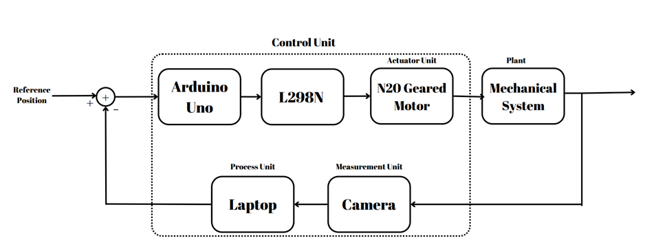

# Ball and Hoop Position Control System

This repository documents our **EE407 Process Control** project, where we implemented and experimentally analyzed a classic **Ball and Hoop position control system**. The setup was originally designed as a laboratory experiment to study nonlinear dynamics, system identification, and controller tuning, but our implementation extended it into a complete closed-loop project integrating software, hardware, and experimental analysis.

---

## 🧠 Project Overview
The **Ball and Hoop system** models the behavior of a ball rolling on the inner surface of a rotating hoop, similar to liquid sloshing in a moving container. Our objective was to model the nonlinear dynamics, identify the linearized system experimentally, and design controllers (P, PI, PD, PID) to stabilize the ball at any desired position.

We structured the project like an experiment for educational clarity, but the implementation, modeling, and validation correspond to a fully functional control system.

---

## ⚙️ Experimental Setup

The system consists of the following components:
- **Actuator:** 12V DC N20 geared motor (60–120 RPM)
- **Motor Driver:** L298N dual H-bridge
- **Controller:** Arduino Uno executing PID algorithm
- **Sensor:** Webcam with Python + OpenCV for real-time position detection
- **Interface:** Serial communication (UART) between Python and Arduino
- **Structure:** 3D-printed hoop and stand (based on Martin Gurtner’s open-source CAD)

  
  
<em>Figure 1. Overall Ball and Hoop experimental setup.</em>

The camera captures the position of the ball, while Python extracts its coordinates and sends them to Arduino. The Arduino executes the control algorithm and drives the motor to minimize the position error. This feedback loop operates in real time, completing the closed-loop system.

---

## 🧩 System Modeling and Identification

We first analyzed the system’s theoretical model using **Lagrange’s equations**, yielding a nonlinear set of coupled equations between hoop angle (θ) and ball displacement (ψ). Under small-angle assumptions (sinψ ≈ ψ) and \(r ≪ R\), we obtained a linearized form that corresponds to a **two-pole, two-zero (2P2Z)** transfer function.

To validate and refine this model, we performed **System Identification (SysID)** in MATLAB:
- The ball was released from random initial positions.
- Position data were recorded using the vision system.
- Using MATLAB’s **System Identification Toolbox**, a 2P2Z transfer function model was estimated.

  
  
<em>Figure 2. Open-loop response of the ball during identification experiment.</em>

To include actuator dynamics, the DC motor was modeled as a first-order system:
\[ G_{motor}(s) = \frac{1}{1 + T_a s} \]
The overall plant model thus became:
\[ G_{total}(s) = G_{plant}(s) \times G_{motor}(s) \]

This model served as the foundation for controller tuning and performance comparison.

---

## 🔧 Control Implementation

The Arduino ran a digital PID controller expressed as:
\[ u(t) = K_p e(t) + K_i \int e(t)\,dt + K_d \frac{de(t)}{dt} \]

### Controllers Tested
- **P Controller:** Fast response but steady-state error.
- **PI Controller:** Reduced steady-state error; slight oscillation.
- **PD Controller:** Enhanced damping; lower overshoot.
- **PID Controller:** Optimal combination of accuracy and stability.

  
  
<em>Figure 3. Closed-loop control block diagram of the Ball and Hoop system.</em>

---

## 📊 Experimental Results
After identification, each controller was implemented and tested experimentally under identical conditions. The ball’s position response was recorded, and key performance metrics such as **settling time (tₛ)** and **percent overshoot (Mₚ)** were calculated.

| Controller | Gains (Kp, Ki, Kd) | Settling Time (s) | Overshoot | Steady-State Error |
|-------------|--------------------|------------------:|-----------:|-------------------:|
| P | (2, 0, 0) | ≈ 1.66 | Low–Medium | ≠ 0 |
| PI | (2, 0.2, 0) | ≈ 2.17 | Medium | ≈ 0 |
| PI (High Ki) | (2, 3, 0) | N/A | High / Oscillatory | Undefined |
| PD | (2, 0, 10) | ≈ 2.07 | Low | ≠ 0 |
| PID | (2, 0.2, 40) | ≈ 2.09 | Low–Medium | ≈ 0 |

The PID configuration achieved the most stable and accurate performance, closely matching the analytical predictions derived from the identified model.

---

## 🧪 Key Observations
- The experimental data confirmed the 2P2Z model structure.
- Integral action successfully removed steady-state error but reduced damping.
- Derivative action restored damping, compensating for phase lag.
- High integral gain introduced limit cycles due to actuator dead-band and camera delay.
- PID provided the best trade-off between accuracy and robustness.

---

## 📚 References
- E. Fabregas et al., “Virtual and remote experimentation with the Ball and Hoop system,” *IEEE Conf. ETFA*, 2009.
- M. Gurtner, J. Zemánek, “Ball in Double Hoop: Demonstration Model for Numerical Optimal Control,” *arXiv:1706.07333*, 2017.
- I. Calvo et al., “A Remote Laboratory for a Basic Course on Control Engineering,” *Int. J. Online Eng.*, 2009.

---

## 🧾 Summary
This project demonstrated both theoretical and practical aspects of control system design, from modeling and identification to real-time implementation. While the structure was presented as an educational experiment, the resulting system behaves as a complete control platform suitable for further research on adaptive or nonlinear control strategies.
